  

  <h3>Python Developer 🐍 • Flutter Developer 💙</h3>

  

   

  

 

## Tech Stack
The technologies I rely on to build clean backend systems, modern cross-platform applications, and efficient developer workflows with a strong focus on simplicity and reliability.

  

 

## GitHub Insights
A compact overview of my development activity, language distribution, and overall coding habits across the projects I build and maintain.

<table align="center">
  <tr>
    <td valign="top">
      
    </td>
    <td valign="top">
      
    </td>
  </tr>
  <tr>
    <td colspan="2" align="center" valign="top">
      
    </td>
  </tr>
</table>

 

  &nbsp;
  &nbsp;
  

